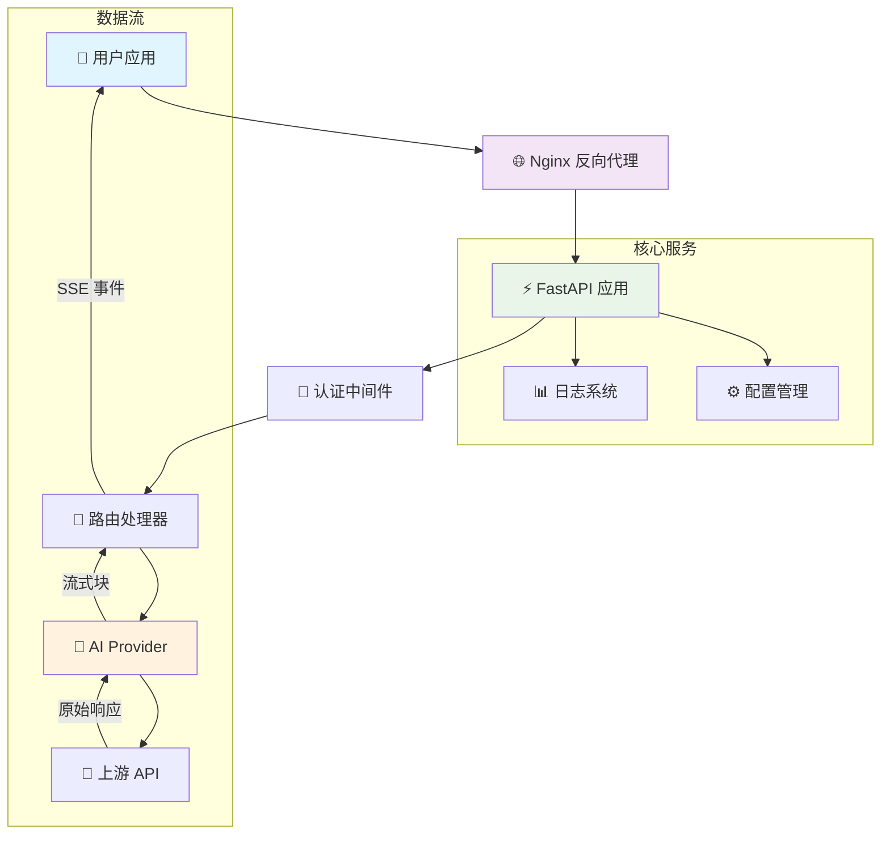
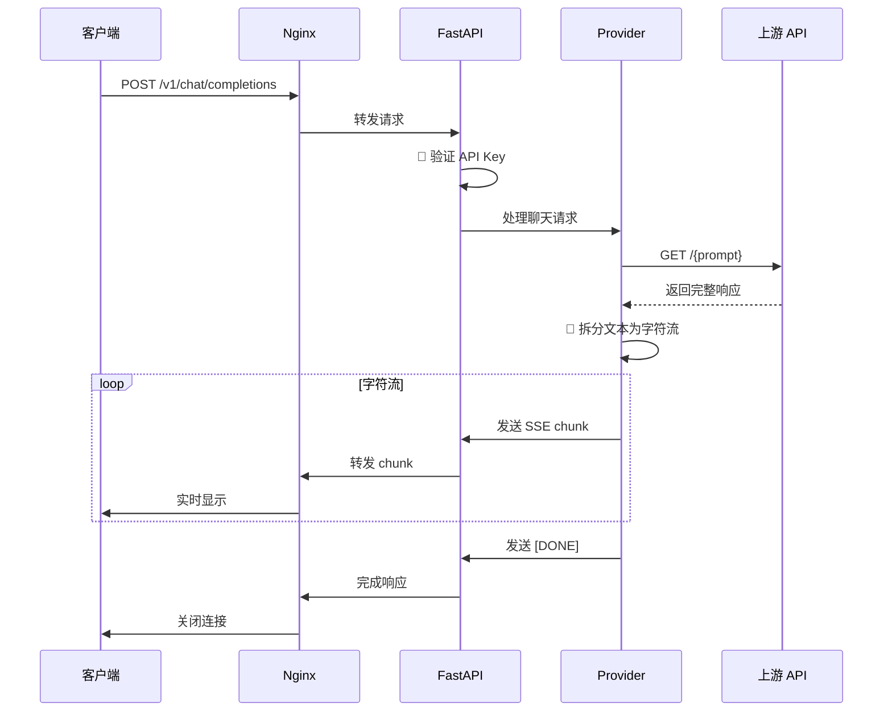
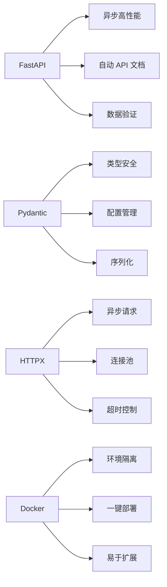
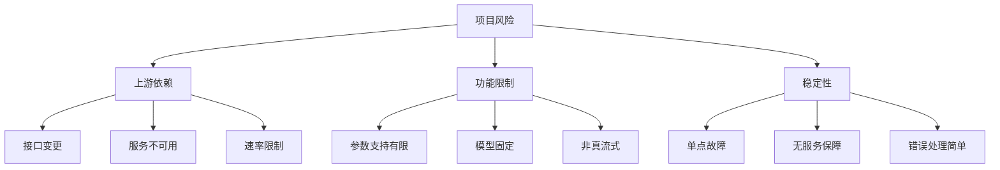
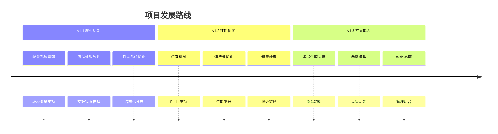

# aianswergenerator-2api 🚀


**中文** | [English](./README.en.md)

> "我们站在巨人的肩膀上，不是为了看得更远，而是为了成为新的巨人，让后来者站得更高。开源，就是我们传递给未来的火炬。" - 一位无名的代码诗人

欢迎来到 `aianswergenerator-2api` 的世界！这是一个充满魔法 ✨ 的开源项目，它将 [aianswergenerator.pro](https://aianswergenerator.pro) 网站背后的免费 AI 对话接口，巧妙地转换成了与 OpenAI API 完全兼容的格式。

这意味着你可以用**极低的成本（几乎为零！）**，将市面上成千上万的优秀 OpenAI 应用和服务，无缝对接到这个免费的后端！无论是各种酷炫的客户端，还是复杂的自动化流程，现在都可以免费"为我所用"！

**仓库链接**: [https://github.com/lzA6/aianswergenerator-2api](https://github.com/lzA6/aianswergenerator-2api)

---

## 📋 目录

- [💖 核心哲学](#-核心哲学)
- [✨ 主要功能](#-主要功能)
- [🏗️ 系统架构](#️-系统架构)
- [📁 项目结构](#-项目结构)
- [🔧 快速开始](#-快速开始)
- [🚀 Docker 部署](#-docker-部署)
- [👨‍💻 手动部署](#-手动部署)
- [💡 API 使用](#-api-使用)
- [🛠️ 技术栈](#️-技术栈)
- [📊 项目分析](#-项目分析)
- [🗺️ 发展路线](#️-发展路线)
- [🤝 贡献指南](#-贡献指南)
- [⚖️ 开源协议](#️-开源协议)

---

## 💖 核心哲学

在这个 AI 浪潮席卷全球的时代，我们每个人都渴望触摸到未来的脉搏。但很多时候，高昂的 API 费用、复杂的技术壁垒，像一堵无形的墙，将许多充满热情和创意的探索者挡在门外。

`aianswergenerator-2api` 的诞生，源于一个纯粹而美好的愿望：**拆掉这堵墙！**

我们相信，技术应该是赋能的工具，而不是设限的门槛。通过这个项目，我们希望：

- **🎯 降低门槛**：让每一位学生、开发者、爱好者，都能无压力地体验和构建 AI 应用
- **💡 激发创造**：当你不再为成本担忧，你的想象力将是唯一的边界
- **🌍 拥抱开源**：这不仅分享代码，更是传递知识、思想和价值观

我们不是技术的奴隶，而是技术的主人。让我们一起，用代码书写属于我们自己的、充满人情味和理想主义的篇章。

---

## ✨ 主要功能

<div align="center">

| 功能 | 描述 | 状态 |
|------|------|------|
| **OpenAI 兼容** | 完美模拟 `/v1/chat/completions` 和 `/v1/models` 接口 | ✅ |
| **伪流式输出** | 模拟打字机效果的流式响应 | ✅ |
| **Docker 部署** | 一键容器化部署 | ✅ |
| **API 密钥保护** | 支持主密钥认证 | ✅ |
| **高性能** | 基于 FastAPI 和异步编程 | ✅ |
| **易于扩展** | 清晰的模块化架构 | ✅ |

</div>

---

## 🏗️ 系统架构

### 整体架构图



### 请求处理流程



---

## 📁 项目结构

```
aianswergenerator-2api/
├── 🐳 Docker 配置
│   ├── Dockerfile              # 容器镜像构建
│   └── docker-compose.yml      # 服务编排
├── 🔧 应用代码
│   ├── main.py                 # FastAPI 主应用
│   ├── requirements.txt        # Python 依赖
│   └── app/                    # 核心模块
│       ├── core/               # 核心配置
│       │   └── config.py       # Pydantic 配置管理
│       ├── providers/          # API 提供商
│       │   ├── base_provider.py    # 提供商基类
│       │   └── aianswergenerator_provider.py  # 核心逻辑
│       └── utils/              # 工具函数
│           └── sse_utils.py    # SSE 流式工具
├── 🌐 网络配置
│   └── nginx.conf              # Nginx 配置
├── ⚙️ 环境配置
│   ├── .env.example            # 配置模板
│   └── .env                    # 实际配置（本地创建）
└── 📚 文档
    ├── README.md               # 主文档
    └── README.en.md            # 英文文档
```

---

## 🔧 快速开始

### 环境要求

- 🐳 Docker & Docker Compose **或**
- 🐍 Python 3.10+

### 一键部署（推荐）

```bash
# 1. 克隆项目
git clone https://github.com/lzA6/aianswergenerator-2api.git
cd aianswergenerator-2api

# 2. 配置环境
cp .env.example .env
# 编辑 .env 文件，设置你的 API_MASTER_KEY

# 3. 启动服务
docker-compose up -d

# 4. 验证服务
curl http://localhost:8090/v1/models -H "Authorization: Bearer your_api_key"
```

---

## 🚀 Docker 部署

### 配置说明

创建 `.env` 文件：

```env
# API 主密钥 - 强烈建议修改！
API_MASTER_KEY=your_super_secret_password_here

# 服务端口
NGINX_PORT=8090

# 可选：流式延迟（秒）
STREAM_DELAY=0.01
```

### 启动命令

```bash
# 启动服务
docker-compose up -d

# 查看日志
docker-compose logs -f

# 停止服务
docker-compose down

# 重启服务
docker-compose restart
```

### 服务状态检查

```bash
# 检查容器状态
docker-compose ps

# 查看服务日志
docker-compose logs app

# 进入容器
docker-compose exec app bash
```

---

## 👨‍💻 手动部署

### 环境准备

```bash
# 克隆项目
git clone https://github.com/lzA6/aianswergenerator-2api.git
cd aianswergenerator-2api

# 创建虚拟环境
python -m venv venv

# 激活虚拟环境
# Linux/macOS:
source venv/bin/activate
# Windows:
# venv\Scripts\activate

# 安装依赖
pip install -r requirements.txt
```

### 配置环境变量

```bash
# Linux/macOS
export API_MASTER_KEY="your_super_secret_password"
export STREAM_DELAY="0.01"

# Windows (CMD)
set API_MASTER_KEY=your_super_secret_password
set STREAM_DELAY=0.01
```

### 启动服务

```bash
# 开发模式（带热重载）
uvicorn main:app --host 0.0.0.0 --port 8000 --reload

# 生产模式
uvicorn main:app --host 0.0.0.0 --port 8000 --workers 2
```

---

## 💡 API 使用

### 基础请求

```bash
curl -X POST http://localhost:8090/v1/chat/completions \
  -H "Content-Type: application/json" \
  -H "Authorization: Bearer your_api_key" \
  -d '{
    "model": "aianswergenerator-openai",
    "messages": [
      {
        "role": "user", 
        "content": "请用中文介绍一下你自己"
      }
    ],
    "stream": true
  }'
```

### Python 客户端示例

```python
import openai

client = openai.OpenAI(
    base_url="http://localhost:8090/v1",
    api_key="your_api_key"
)

response = client.chat.completions.create(
    model="aianswergenerator-openai",
    messages=[
        {"role": "user", "content": "你好！请介绍一下这个项目"}
    ],
    stream=True
)

for chunk in response:
    if chunk.choices[0].delta.content:
        print(chunk.choices[0].delta.content, end="", flush=True)
```

### JavaScript 客户端示例

```javascript
import OpenAI from 'openai';

const client = new OpenAI({
  baseURL: 'http://localhost:8090/v1',
  apiKey: 'your_api_key',
});

const stream = await client.chat.completions.create({
  model: 'aianswergenerator-openai',
  messages: [{ role: 'user', content: 'Hello!' }],
  stream: true,
});

for await (const chunk of stream) {
  process.stdout.write(chunk.choices[0]?.delta?.content || '');
}
```

---

## 🛠️ 技术栈

<div align="center">

| 层级 | 技术 | 版本 | 用途 |
|------|------|------|------|
| **🌐 代理层** | Nginx | latest | 反向代理、负载均衡 |
| **⚡ 应用层** | FastAPI | 0.104+ | 现代异步 Web 框架 |
| **🔧 运行时** | Uvicorn | 0.24+ | ASGI 服务器 |
| **🐍 语言** | Python | 3.10+ | 主编程语言 |
| **📦 容器** | Docker | 20.10+ | 容器化部署 |
| **🔐 认证** | Pydantic | 2.5+ | 数据验证和配置管理 |
| **🌐 客户端** | HTTPX | 0.25+ | 异步 HTTP 客户端 |
| **📊 日志** | Loguru | 0.7+ | 结构化日志记录 |

</div>

### 核心技术特性



---

## 📊 项目分析

### 优势分析

<div align="center">

| 优势 | 影响 | 级别 |
|------|------|------|
| 💰 **零成本** | 极大降低使用门槛 | 🔥🔥🔥 |
| 🔌 **生态兼容** | 无缝接入现有工具 | 🔥🔥🔥 |
| 🚀 **部署简单** | Docker 一键部署 | 🔥🔥 |
| ✨ **用户体验** | 伪流式实时响应 | 🔥🔥 |
| 📦 **轻量高效** | 低资源占用 | 🔥 |

</div>

### 风险分析



### 改进建议

1. **🛡️ 风险缓解**
   - 添加备用 API 源
   - 实现请求重试机制
   - 增加健康检查

2. **🚀 功能增强**
   - 支持更多模型参数
   - 添加响应缓存
   - 实现请求限流

3. **🔧 运维改进**
   - 添加监控指标
   - 完善日志系统
   - 配置管理增强

---

## 🗺️ 发展路线

### 当前版本 (v1.0)

- ✅ OpenAI API 兼容
- ✅ 伪流式输出
- ✅ Docker 部署
- ✅ API 密钥认证
- ✅ 基础错误处理

### 短期规划 (v1.1-v1.3)



### 长期愿景

1. **🌐 多提供商架构**
   - 可插拔提供商系统
   - 智能路由和负载均衡
   - 故障自动切换

2. **🔧 企业级功能**
   - 用户管理和配额
   - 审计日志
   - 监控告警

3. **🎯 开发者体验**
   - 完整的 SDK
   - 详细文档
   - 示例项目

---

## 🤝 贡献指南

我们欢迎所有形式的贡献！以下是参与项目的几种方式：

### 代码贡献

1. **Fork 项目**
   ```bash
   git clone https://github.com/lzA6/aianswergenerator-2api.git
   cd aianswergenerator-2api
   ```

2. **创建功能分支**
   ```bash
   git checkout -b feature/amazing-feature
   ```

3. **提交更改**
   ```bash
   git commit -m 'feat: add amazing feature'
   git push origin feature/amazing-feature
   ```

4. **发起 Pull Request**

### 贡献类型

| 类型 | 说明 | 示例 |
|------|------|------|
| **🐛 Bug 修复** | 修复代码缺陷 | `fix: 解决流式输出中断问题` |
| **✨ 新功能** | 添加新特性 | `feat: 支持多提供商负载均衡` |
| **📚 文档改进** | 完善文档 | `docs: 添加 API 使用示例` |
| **🔧 代码优化** | 重构或优化 | `refactor: 优化提供商抽象层` |
| **🎨 界面改进** | UI/UX 优化 | `style: 改进管理界面布局` |

### 开发环境设置

```bash
# 1. 设置开发环境
python -m venv venv
source venv/bin/activate
pip install -r requirements.txt

# 2. 安装开发依赖
pip install pytest black flake8 mypy

# 3. 代码质量检查
black app/ tests/
flake8 app/ tests/
mypy app/
```

---

## ⚖️ 开源协议

本项目采用 **Apache License 2.0** 开源协议。

### 协议要点

| 权利 | 义务 | 限制 |
|------|------|------|
| ✅ 商业使用 | 📝 保留版权声明 | ❌ 无商标授权 |
| ✅ 修改源码 | 📝 声明变更 | ❌ 不提供担保 |
| ✅ 分发副本 | 📝 包含许可证 | ❌ 不承担责任 |
| ✅ 专利授权 | 📝 通知要求 | |

### 完整协议

请查看 [LICENSE](LICENSE) 文件了解完整的协议内容，或访问 [Apache 2.0 协议官网](https://www.apache.org/licenses/LICENSE-2.0)。

---

## 🎯 下一步

### 快速体验

1. **🚀 [立即部署](#-快速开始)** - 5分钟搭建属于你的免费 AI API
2. **💡 [查看示例](#-api-使用)** - 学习如何调用 API
3. **🔧 [参与开发](#-贡献指南)** - 加入我们的开源社区

### 获取帮助

- 📖 [查看文档](docs/) - 详细的开发文档
- 🐛 [报告问题](https://github.com/lzA6/aianswergenerator-2api/issues) - 反馈 Bug 或建议
- 💬 [讨论交流](https://github.com/lzA6/aianswergenerator-2api/discussions) - 加入社区讨论

### 支持项目

如果这个项目对你有帮助，请考虑：

- ⭐ **给个 Star** - 让更多人看到这个项目
- 📢 **分享推荐** - 分享给有需要的朋友
- 💻 **贡献代码** - 一起让项目变得更好

---

<div align="center">

**愿你的每一次 `git push`，都充满激情与热爱。Happy Coding! ❤️**

[🚀 快速开始](#-快速开始) | [📖 查看文档](docs/) | [🐛 报告问题](https://github.com/lzA6/aianswergenerator-2api/issues) | [💬 加入讨论](https://github.com/lzA6/aianswergenerator-2api/discussions)

</div>

---
